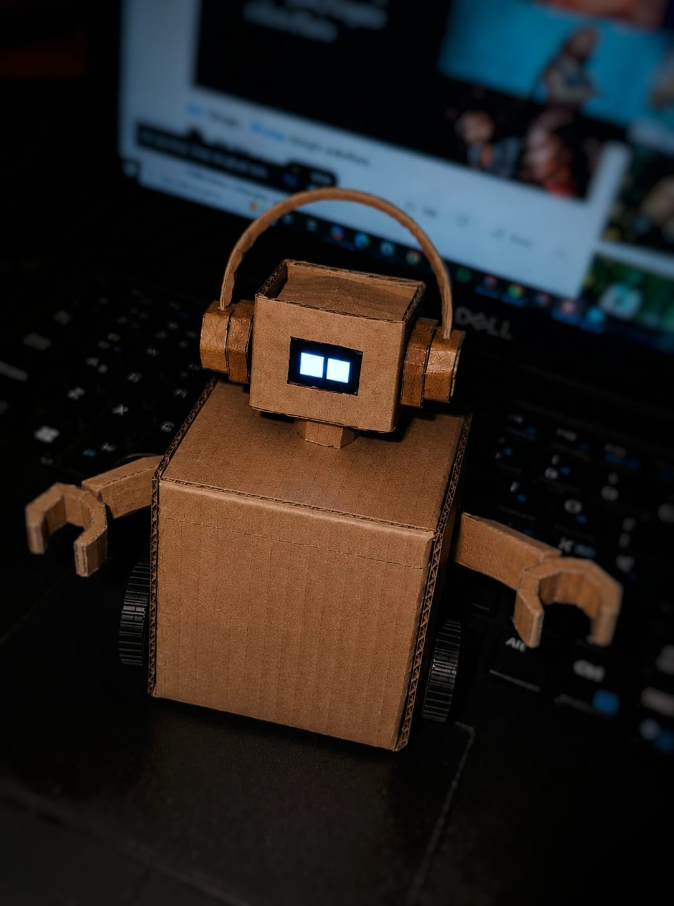

# 🤖 TSLV: Touch Sensor LED (Voice) Robot

**TSLV** is a compact, interactive companion robot powered by an ESP32 microcontroller. Housed in a custom-built, sustainable cardboard chassis, TSLV combines Bluetooth teleoperation, capacitive touch reactivity, and expressive digital animations. 

*(Note: The 'V' in TSLV originally stood for Voice. While the voice module was ultimately scoped out of the final build, the name stuck!)*

  

## 🚀 Key Features
* **Expressive OLED Eyes:** Utilizes an I2C SSD1306 OLED display to render dynamic facial expressions. The robot idly blinks and transitions to a "happy" expression when physically petted (via touch sensors).
* **Capacitive Touch Interactivity:** Digital touch sensors allow the robot to physically react to its environment, overriding manual controls to execute pre-programmed movement dances when interacted with.
* **Bluetooth Teleoperation:** Fully controllable via smartphone using standard Bluetooth Serial communication (sending `F`, `B`, `L`, `R` commands).
* **Differential Drive System:** 4-wheel/2-track motor setup for zero-radius turning and agile movement.

## 🛠️ Hardware Architecture
* **Brain:** ESP32 Microcontroller
* **Face:** 128x64 I2C OLED Display (SSD1306)
* **Sensors:** Digital Capacitive Touch Sensors
* **Actuators:** DC Gear Motors + Motor Driver (e.g., L298N)
* **Chassis:** Custom-fabricated cardboard enclosure

## 📁 Repository Structure
The project code is currently modularized for testing specific subsystems:
* `tslvmd.ino` - Handles the Bluetooth Serial communication (`BluetoothSerial.h`), motor pin logic, and touch sensor movement overrides.
* `oledeyes.ino` - Handles the Adafruit GFX rendering for the OLED display, drawing the dynamic rectangles and circles that make up the robot's blinking and happy states.

## ⚙️ Setup and Installation

### 1. Arduino IDE Setup
To flash this code to your ESP32, ensure you have the ESP32 board manager installed in the Arduino IDE.

### 2. Required Libraries
You will need to install the following libraries via the Arduino Library Manager:
* `Adafruit GFX Library`
* `Adafruit SSD1306`

### 3. Bluetooth Control
1. Flash `tslvmd.ino` to the ESP32.
2. Download a standard "Bluetooth Serial Terminal" app on your smartphone.
3. Pair with the device named **TSLV**.
4. Send the characters `F`, `B`, `L`, or `R` to drive the robot.

## 👨‍💻 Project Creators
* Anandhu Biju
* Amarjith H
* Abel Sebastian
